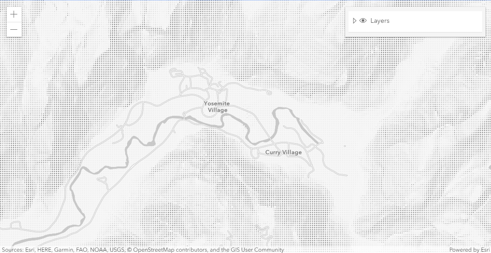
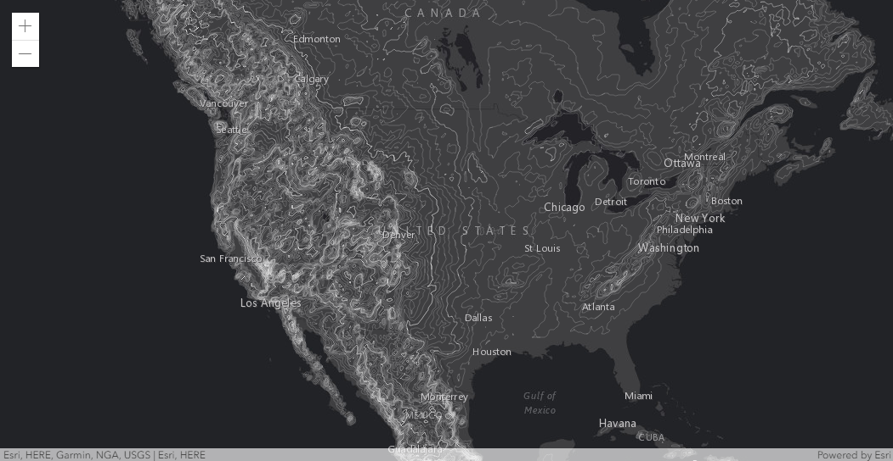
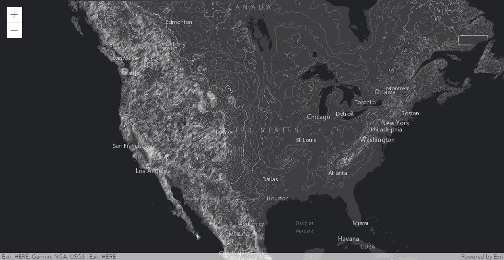

A collection of examples of custom layers using the ArcGIS API for JavaScript.

### Styled Hillshade

### Generate contours from ArcGIS Online World Elevation Service

### Generate contours from ArcGIS Online premium elevation service

